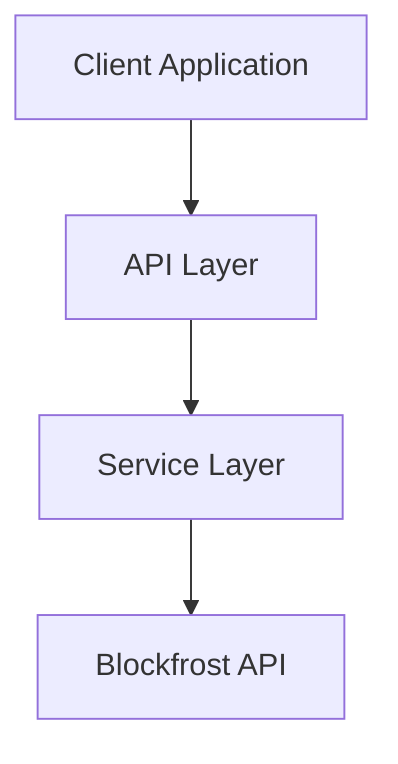

# Cardano Block Explorer

A lightweight, high-performance block explorer for the Cardano blockchain built with vanilla JavaScript and the Blockfrost API. This application provides real-time blockchain data visualization with robust security features and a clean, responsive interface.



## 🚀 Features

### Real-time Block Information

- Latest block data auto-refresh
- Detailed block information display
- Transaction list viewing with pagination
- Block navigation and search
- Advanced transaction details with UTXO tracking
- Address tracking and balance display

### Performance Optimized

- Efficient DOM updates with modular renderers
- Debounced search and event handlers
- Optimized rendering cycles
- BigInt support for precise calculations
- Smart date formatting and validation
- Responsive UI components

### Security First

- Rate limiting protection
- Secure headers (Helmet)
- CORS protection
- API key validation
- Input validation and sanitization
- Error handling and logging
- Type checking and validation

For detailed security information, see [SECURITY.md](docs/SECURITY.md).

### Clean UI/UX

- Responsive design with mobile support
- Enhanced loading states
- Comprehensive error handling
- Clear navigation with breadcrumbs
- Smooth transitions
- Copy-to-clipboard functionality
- Warning/Error differentiation

## 🛠️ Prerequisites

- Node.js (v18 or higher)
- npm (v8 or higher)
- Blockfrost API key ([Get one here](https://blockfrost.io))

## 📦 Installation

1. Clone the repository:

   ```bash
   git clone https://github.com/Jimmyh-world/cardano-explorer.git
   cd cardano-block-explorer
   ```

2. Install dependencies:

   ```bash
   npm install
   ```

3. Create `.env` file:
   ```env
   BLOCKFROST_API_KEY=your_api_key_here
   NODE_ENV=development
   ```

## 🚀 Deployment Options

### Local Development

```bash
# Start the development server
npm run dev

# The application will be available at http://localhost:3001
```

### Production Deployment (Vercel)

1. Connect your repository to Vercel
2. Set environment variables in Vercel dashboard
3. Deploy using the provided `vercel.json` configuration

For detailed deployment information, see [TECHNICAL.md](/docs/TECHNICAL.md#deployment-process).

## 🏗️ Project Structure

```
cardano-block-explorer/
├── server/
│   ├── middleware/        # Error handling and validation
│   ├── services/         # Blockfrost API integration
│   │   └── blockfrost/  # Blockfrost service implementation
│   ├── utils/           # Shared utilities
│   └── server.js        # Express server
├── js/
│   ├── api.js           # API client
│   ├── utils.js         # Client utilities
│   ├── main.js          # Application entry
│   └── renderers/       # UI components
├── css/
│   ├── modules/        # CSS modules
│   └── styles.css      # Main styles
├── pages/              # Static pages
├── docs/              # Documentation
├── vercel.json        # Vercel configuration
└── index.html         # Entry point
```

For detailed architecture information, see [ARCHITECTURE.md](/docs/ARCHITECTURE.md).

## 🔒 Security Features

For comprehensive security documentation, see [SECURITY.md](/docs/SECURITY.md).

Key security features include:

- Rate limiting (100 requests per 15 minutes)
- HTTP security headers via Helmet
- CORS protection with environment config
- API key validation and security
- Comprehensive error handling
- Input validation and sanitization
- Production error sanitization
- Secure number handling with BigInt

## 📚 Documentation

- [Architecture Overview](docs/ARCHITECTURE.md)
- [Technical Documentation](docs/TECHNICAL.md)
- [API Documentation](docs/API.md)
- [Security Guidelines](docs/SECURITY.md)

## 🧪 Testing

For detailed API testing information, see [API.md](/docs/API.md#testing).

Quick test examples:

```bash
# Get latest block
curl http://localhost:3001/api/blocks/latest | json_pp

# Get specific block
curl http://localhost:3001/api/blocks/{block_hash} | json_pp

# Get block transactions
curl http://localhost:3001/api/blocks/{block_hash}/transactions | json_pp

# Get transaction details
curl http://localhost:3001/api/tx/{tx_hash} | json_pp

# Search
curl http://localhost:3001/api/blocks/search?q={query} | json_pp
```

## 🤝 Contributing

1. Fork the repository
2. Create your feature branch
3. Follow code style guidelines:
   - Use meaningful variable names
   - Add JSDoc comments
   - Follow type checking practices
   - Update documentation
   - Test thoroughly
4. Submit a pull request

For detailed contribution guidelines, see [TECHNICAL.md](/docs/TECHNICAL.md#contributing-guidelines).

## 📧 Contact

James Barclay - jamesqbarclay@gmail.com

## 🗺️ Roadmap

Current Status:

- [x] Advanced transaction details
- [x] Address tracking
- [x] Search functionality

Upcoming Features:

- [ ] Asset information display
- [ ] Stake pool integration
- [ ] WebSocket updates
- [ ] Caching layer
- [ ] TypeScript migration

For detailed enhancement plans, see [TECHNICAL.md](/docs/TECHNICAL.md#future-enhancements).
