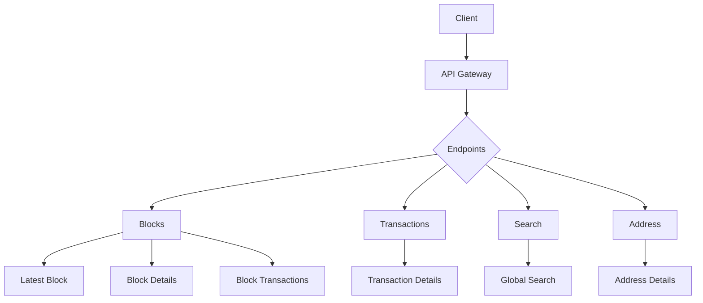
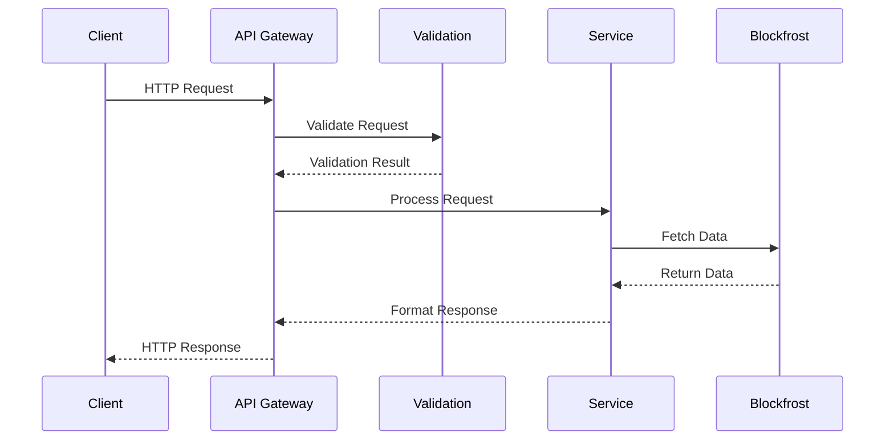

# API Documentation

> For detailed security implementations, see [SECURITY.md](/docs/SECURITY.md)

## Overview



## Base URL

```
Development: http://localhost:3001/api
Production: https://your-domain.vercel.app/api
```

## Request Flow



## Authentication

For detailed authentication implementation, see [SECURITY.md](/docs/SECURITY.md#authentication-system).

## Rate Limiting

For detailed rate limiting configuration, see [SECURITY.md](/docs/SECURITY.md#rate-limiting).

Headers returned:

- `X-RateLimit-Limit`: Maximum requests
- `X-RateLimit-Remaining`: Remaining requests
- `X-RateLimit-Reset`: Time until reset

## Endpoints

### Blocks

#### Get Latest Block

```http
GET /blocks/latest
```

Response:

```json
{
  "success": true,
  "data": {
    "hash": "string",
    "height": "number",
    "slot": "number",
    "epoch": "number",
    "epoch_slot": "number",
    "slot_leader": "string",
    "size": "number",
    "time": "number",
    "tx_count": "number",
    "output": "string",
    "fees": "string",
    "block_vrf": "string",
    "previous_block": "string",
    "next_block": "string",
    "confirmations": "number"
  }
}
```

#### Get Block Details

```http
GET /blocks/:hash
```

Parameters:

- `hash`: Block hash (64 characters)

Response: Same as latest block

#### Get Block by Height

```http
GET /blocks/height/:height
```

Parameters:

- `height`: Block height (number)

Response:

```json
{
  "success": true,
  "data": ["block_hash"]
}
```

#### Get Block Transactions

```http
GET /blocks/:hash/transactions
```

Parameters:

- `hash`: Block hash (64 characters)

Response:

```json
{
  "success": true,
  "data": {
    "transactions": [
      {
        "hash": "string",
        "block": "string",
        "block_time": "number",
        "inputs": "number",
        "outputs": "number",
        "input_amount": "string",
        "output_amount": "string",
        "fees": "string"
      }
    ]
  }
}
```

### Transactions

#### Get Transaction Details

```http
GET /tx/:hash
```

Parameters:

- `hash`: Transaction hash (64 characters)

Response:

```json
{
  "success": true,
  "data": {
    "hash": "string",
    "block_hash": "string",
    "block_height": "number",
    "block_time": "number",
    "slot": "number",
    "index": "number",
    "output_amount": "string",
    "input_amount": "string",
    "fees": "string",
    "deposit": "string",
    "size": "number",
    "invalid_before": "string",
    "invalid_hereafter": "string",
    "utxos": {
      "inputs": [
        {
          "tx_hash": "string",
          "output_index": "number",
          "amount": "string",
          "address": "string"
        }
      ],
      "outputs": [
        {
          "address": "string",
          "amount": "string",
          "assets": [
            {
              "unit": "string",
              "quantity": "string"
            }
          ]
        }
      ]
    }
  }
}
```

### Search

#### Global Search

```http
GET /blocks/search?q=:query
```

Parameters:

- `q`: Search query (min 3 characters)

Response:

```json
{
  "success": true,
  "data": {
    "type": "string", // "block", "transaction", "address", "stake_address", "pool"
    "result": {
      // Varies based on type
    }
  }
}
```

### Address

#### Get Address Details

```http
GET /blocks/address/:address
```

Parameters:

- `address`: Cardano address

Response:

```json
{
  "success": true,
  "data": {
    "address": "string",
    "amount": "string",
    "stake_address": "string",
    "type": "string",
    "utxos": [
      {
        "tx_hash": "string",
        "output_index": "number",
        "amount": "string",
        "assets": []
      }
    ],
    "transactions": [
      {
        "tx_hash": "string",
        "block_height": "number",
        "block_time": "number",
        "block_hash": "string"
      }
    ]
  }
}
```

## Error Handling

All endpoints return errors in a consistent format with environment-specific details:

```javascript
// Development Environment Response
{
  "success": false,
  "status": 400,
  "error": "Invalid block hash format: abc123",
  "path": "/api/blocks/abc123",
  "stack": "ValidationError: Invalid block hash format...",
  "type": "ValidationError"
}

// Production Environment Response
{
  "success": false,
  "status": 400,
  "error": "Invalid block hash format: [HASH]"
}
```

### Error Types

The API uses standardized error types for consistent error handling:

```javascript
const ERROR_TYPES = {
  VALIDATION: 'ValidationError', // 400 Bad Request
  API: 'APIError', // 500 Internal Server Error
  NETWORK: 'NetworkError', // 503 Service Unavailable
  DATABASE: 'DatabaseError', // 503 Service Unavailable
  AUTH: 'AuthenticationError', // 401 Unauthorized
};
```

### Status Codes

```javascript
const STATUS_CODES = {
  OK: 200, // Successful request
  BAD_REQUEST: 400, // Invalid input
  UNAUTHORIZED: 401, // Missing or invalid authentication
  FORBIDDEN: 403, // Valid auth but insufficient permissions
  NOT_FOUND: 404, // Resource not found
  TIMEOUT: 408, // Request timeout
  CONFLICT: 409, // Resource conflict
  INTERNAL_ERROR: 500, // Server error
  SERVICE_UNAVAILABLE: 503, // Service temporarily unavailable
};
```

### Error Responses by Type

#### Validation Error

```json
{
  "success": false,
  "status": 400,
  "error": "Invalid input: Block hash must be 64 characters"
}
```

#### Authentication Error

```json
{
  "success": false,
  "status": 401,
  "error": "API key is missing or invalid"
}
```

#### Not Found Error

```json
{
  "success": false,
  "status": 404,
  "error": "Block not found"
}
```

#### Timeout Error

```json
{
  "success": false,
  "status": 408,
  "error": "Request timed out"
}
```

#### Server Error

```json
{
  "success": false,
  "status": 500,
  "error": "Internal server error"
}
```

## Rate Limiting

The API implements rate limiting with the following configuration:

```javascript
const RATE_LIMIT_CONFIG = {
  windowMs: 15 * 60 * 1000, // 15 minutes
  max: 100, // 100 requests per window
  standardHeaders: true, // Return rate limit info in headers
  legacyHeaders: false, // Disable legacy X-RateLimit headers
};
```

### Rate Limit Headers

Responses include the following headers:

- `RateLimit-Limit`: Maximum requests allowed per window
- `RateLimit-Remaining`: Remaining requests in current window
- `RateLimit-Reset`: Time in seconds until the rate limit resets

### Rate Limit Exceeded Response

```json
{
  "success": false,
  "status": 429,
  "error": "Too many requests, please try again later"
}
```

## Performance Monitoring

The API includes performance monitoring for request handling:

### Slow Request Detection

```javascript
const MONITORING = {
  SLOW_THRESHOLD: 5000, // 5 seconds
};
```

Requests exceeding the threshold are logged with:

- Request path and method
- Duration in milliseconds
- Timestamp
- Additional context if available

### Request Timeouts

```javascript
const TIMEOUTS = {
  DEFAULT: 30000, // 30 seconds
  API: 15000, // 15 seconds
  DATABASE: 60000, // 60 seconds
};
```

## Client Utilities

### API Client

```javascript
import {
  getLatestBlock,
  getBlockDetails,
  getBlockTransactions,
  getTransactionDetails,
  search,
} from './api.js';

// Get latest block
const latestBlock = await getLatestBlock();

// Get block details
const block = await getBlockDetails(hashOrHeight);

// Get block transactions
const transactions = await getBlockTransactions(blockHash);

// Get transaction details
const transaction = await getTransactionDetails(txHash);

// Search
const results = await search(query);
```

### Response Handling

```javascript
import { formatSuccess, formatError } from './utils/responseFormatter.js';

// Success response
const success = formatSuccess(data);

// Error response
const error = formatError(new Error('Not found'));

// Paginated response
const paginated = formatPagination(data, {
  currentPage: 1,
  totalPages: 10,
  hasNext: true,
  hasPrevious: false,
  totalItems: 100,
});
```

### Error Handling

```javascript
import { APIError } from './utils/APIError.js';
import { logger } from './utils/logger.js';

try {
  // API operations
} catch (error) {
  logger.error('Operation failed', { error });
  throw new APIError(error.message, error.status);
}
```

## Pagination

When applicable, endpoints support pagination with the following parameters:

- `page`: Page number (default: 1)
- `limit`: Items per page (default: 10, max: 100)

Response includes pagination metadata:

```json
{
  "success": true,
  "data": [],
  "pagination": {
    "currentPage": 1,
    "totalPages": 10,
    "hasNext": true,
    "hasPrevious": false,
    "totalItems": 100
  }
}
```

## WebSocket Support

Future enhancement: See [SECURITY.md](/docs/SECURITY.md#future-security-enhancements) for planned WebSocket implementation details.

## API Versioning

Current version: v1
Format: `/api/v1/{endpoint}`

## Additional Resources

- [Security Documentation](/docs/SECURITY.md)
- [Architecture Documentation](/docs/ARCHITECTURE.md)
- [Technical Documentation](/docs/TECHNICAL.md)
