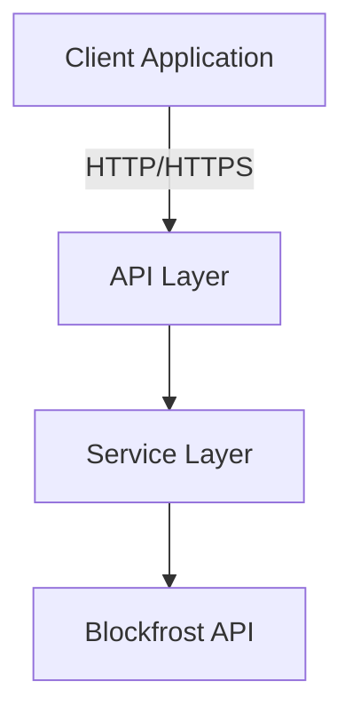
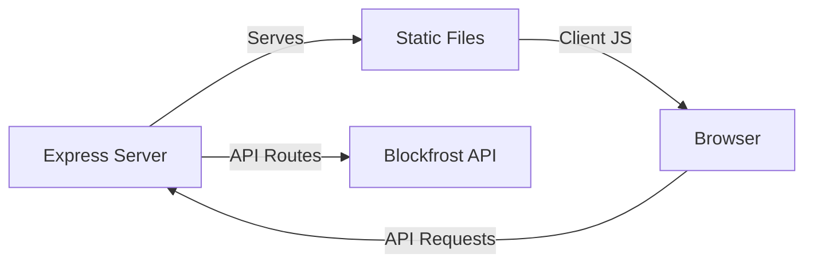
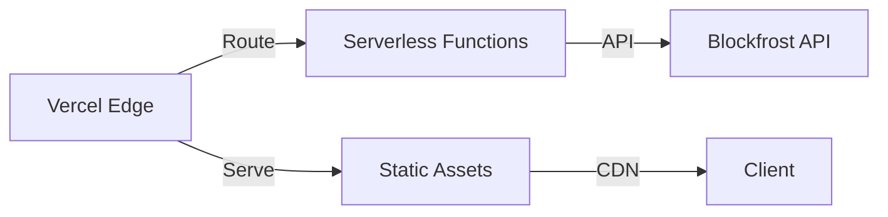

# Cardano Block Explorer Architecture

> For detailed technical specifications and implementation details, see [TECHNICAL.md](/docs/TECHNICAL.md)

## Overview

A lightweight, high-performance block explorer for the Cardano blockchain built with vanilla JavaScript and the Blockfrost API. This application provides real-time blockchain data visualization with robust security features and a clean, responsive interface.



## Project Structure

```
cardano-explorer/
├── server/
│   ├── middleware/          # Request processing and error handling
│   │   ├── errorHandler.js  # Centralized error handling
│   │   ├── asyncHandler.js  # Async operation wrapper
│   │   └── validators.js    # Input validation
│   ├── services/           # Business logic and external services
│   │   └── blockfrost/    # Blockfrost API integration
│   ├── utils/             # Server utilities
│   │   ├── APIError.js    # Custom error handling
│   │   └── validators.js  # Validation utilities
│   └── server.js          # Express server setup
├── public/                # Client-side assets
│   ├── js/               # JavaScript modules
│   │   ├── api.js        # API client
│   │   ├── utils.js      # Client utilities
│   │   ├── main.js       # Application entry
│   │   ├── wallet.js     # Wallet functionality
│   │   ├── ui.js         # UI controllers
│   │   └── renderers/    # UI components
│   │       ├── shared.js    # Shared components
│   │       ├── search.js    # Search functionality
│   │       └── transactions.js # Transaction views
│   ├── css/              # Stylesheets
│   │   ├── modules/     # CSS modules
│   │   └── styles.css   # Main styles
│   └── assets/          # Static assets
│       ├── images/      # Image resources
│       └── icons/       # Icon assets
├── tests/              # Test suites
│   ├── unit/          # Unit tests
│   ├── integration/   # Integration tests
│   └── e2e/          # End-to-end tests
└── docs/              # Documentation
```

## Core Components

### Middleware Layer

The middleware layer provides robust request processing and error handling:

1. **Error Handler (`errorHandler.js`)**

   - Centralized error processing
   - Environment-specific error responses
   - Security-focused message sanitization
   - Error metrics tracking
   - Custom error type support

2. **Async Handler (`asyncHandler.js`)**

   - Promise rejection handling
   - Request timeout management
   - Performance monitoring
   - Error context preservation
   - Custom timeout configurations

3. **Validators (`validators.js`)**
   - Input validation
   - Request sanitization
   - Type checking
   - Security validation

### Client-Side Architecture

The client-side code is organized into modular components:

1. **Core Modules**

   - API client for server communication
   - Utility functions for common operations
   - Main application controller

2. **UI Components**

   - Shared components for reusability
   - Specialized renderers for different views
   - Transaction and wallet management
   - Search functionality

3. **Asset Management**
   - Organized static assets
   - Modular CSS structure
   - Icon and image resources

## Core Dependencies

### Production

- express: Web framework
- cors: Cross-origin resource sharing
- helmet: Security headers
- node-fetch: HTTP client
- dotenv: Environment configuration
- express-rate-limit: Rate limiting.

### Development

- nodemon: Development server

## Deployment Architectures

### Development Architecture



### Production Architecture



## Security Implementation

For detailed security implementations and configurations, see [TECHNICAL.md](/docs/TECHNICAL.md#security-best-practices)

Key features:

- Rate limiting protection
- Secure headers via Helmet
- CORS protection
- Input validation
- API key validation.
- Error sanitization

## Performance Optimization

- Edge network deployment
- CDN distribution
- Static optimization
- Cache headers
- Response compression

## Future Considerations

1. TypeScript Migration

   - Type definitions
   - Interface declarations
   - Better IDE support

2. Testing Implementation

   - Unit tests
   - Integration tests
   - E2E tests
   - Performance testing

3. Feature Expansion

   - Asset information
   - Stake pool integration
   - WebSocket updates
   - Caching layer
   - User authentication

4. Monitoring
   - Error tracking
   - Performance metrics
   - Usage analytics
   - Health checks
   - Security auditing

## Contributing

For detailed contribution guidelines and technical specifications, see [TECHNICAL.md](/docs/TECHNICAL.md#contributing-guidelines)

1. Fork the repository
2. Create your feature branch
3. Follow code style guidelines
4. Test thoroughly
5. Submit a pull request

## Documentation

- [Technical Documentation](/docs/TECHNICAL.md)
- [API Documentation](/docs/API.md)
- [Security Guidelines](/docs/SECURITY.md)

## Contact

James Barclay - jamesqbarclay@gmail.com
