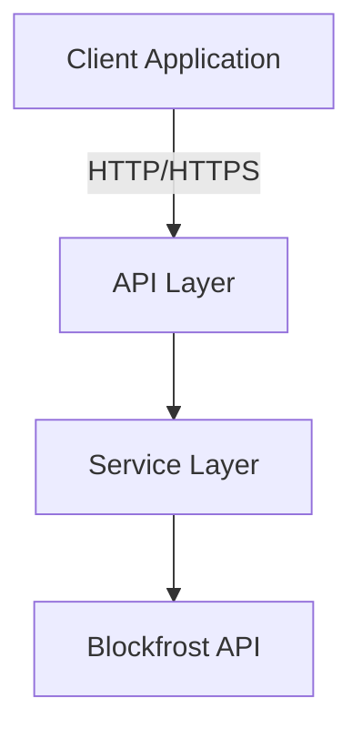
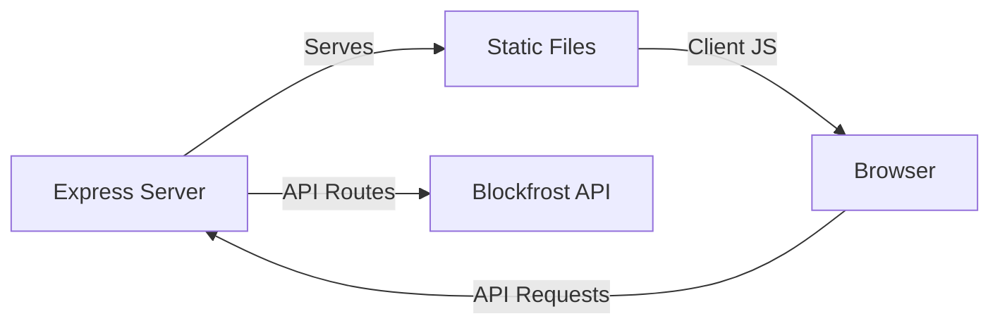
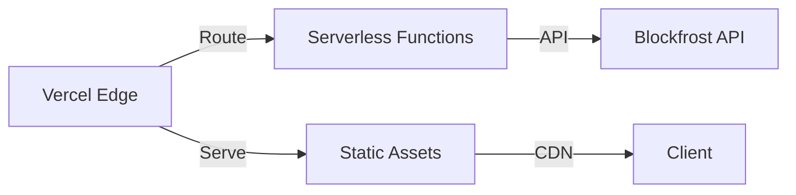

# Cardano Block Explorer Architecture

> For detailed technical specifications and implementation details, see [TECHNICAL.md](/docs/TECHNICAL.md)

## Overview

A lightweight, high-performance block explorer for the Cardano blockchain built with vanilla JavaScript and the Blockfrost API. This application provides real-time blockchain data visualization with robust security features and a clean, responsive interface.



## Project Structure

```
cardano-explorer/
├── server/
│   ├── middleware/        # Error handling and validation
│   ├── services/         # Blockfrost API integration
│   ├── utils/           # Shared utilities
│   └── server.js        # Express server
├── js/
│   ├── api.js           # API client
│   ├── utils.js         # Client utilities
│   ├── main.js          # Application entry
│   └── renderers/       # UI components
├── css/
│   └── styles.css       # Main styles
├── pages/              # Static pages
└── docs/              # Documentation
```

## Core Dependencies

### Production

- express: Web framework
- cors: Cross-origin resource sharing
- helmet: Security headers
- node-fetch: HTTP client
- dotenv: Environment configuration
- express-rate-limit: Rate limiting.

### Development

- nodemon: Development server

## Deployment Architectures

### Development Architecture



### Production Architecture



## Security Implementation

For detailed security implementations and configurations, see [TECHNICAL.md](/docs/TECHNICAL.md#security-best-practices)

Key features:

- Rate limiting protection
- Secure headers via Helmet
- CORS protection
- Input validation
- API key validation.
- Error sanitization

## Performance Optimization

- Edge network deployment
- CDN distribution
- Static optimization
- Cache headers
- Response compression

## Future Considerations

1. TypeScript Migration

   - Type definitions
   - Interface declarations
   - Better IDE support

2. Testing Implementation

   - Unit tests
   - Integration tests
   - E2E tests
   - Performance testing

3. Feature Expansion

   - Asset information
   - Stake pool integration
   - WebSocket updates
   - Caching layer
   - User authentication

4. Monitoring
   - Error tracking
   - Performance metrics
   - Usage analytics
   - Health checks
   - Security auditing

## Contributing

For detailed contribution guidelines and technical specifications, see [TECHNICAL.md](/docs/TECHNICAL.md#contributing-guidelines)

1. Fork the repository
2. Create your feature branch
3. Follow code style guidelines
4. Test thoroughly
5. Submit a pull request

## Documentation

- [Technical Documentation](/docs/TECHNICAL.md)
- [API Documentation](/docs/API.md)
- [Security Guidelines](/docs/SECURITY.md)

## Contact

James Barclay - jamesqbarclay@gmail.com
