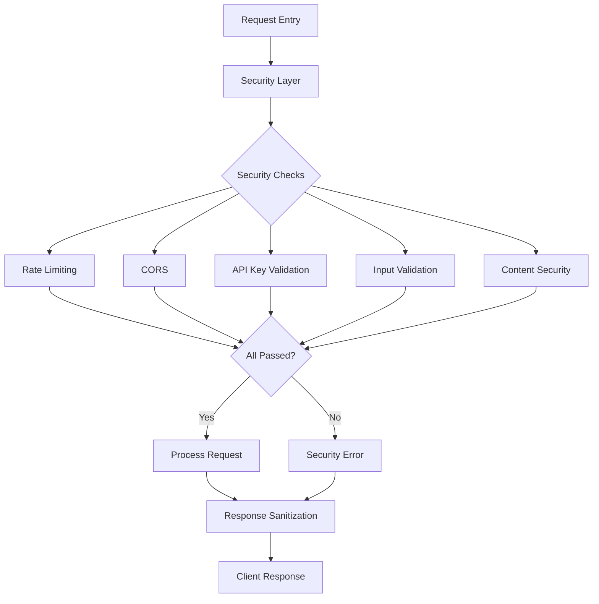
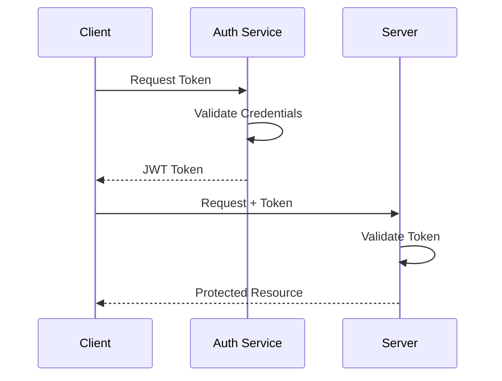

# Security Guidelines

## Overview

This document outlines the security measures, implementation details, and future security roadmap for the Cardano Block Explorer. For API-specific security measures and endpoint documentation, see [API.md](/docs/API.md).



## API Security

### Rate Limiting

```javascript
const limiter = rateLimit({
  windowMs: 15 * 60 * 1000, // 15 minutes
  max: 100, // limit each IP to 100 requests per windowMs
  standardHeaders: true, // Return rate limit info in the `RateLimit-*` headers
  legacyHeaders: false, // Disable the `X-RateLimit-*` headers
  message: {
    status: 'error',
    message: 'Too many requests, please try again later.',
    type: 'rate_limit_exceeded',
  },
});
```

### Security Headers

Using Helmet middleware with strict configuration:

```javascript
app.use(
  helmet({
    contentSecurityPolicy: {
      directives: {
        defaultSrc: ["'self'"],
        scriptSrc: ["'self'"],
        styleSrc: ["'self'"],
        imgSrc: ["'self'"],
        connectSrc: ["'self'", 'https://cardano-mainnet.blockfrost.io'],
      },
    },
    hsts: process.env.NODE_ENV === 'production',
    referrerPolicy: { policy: 'same-origin' },
    frameguard: { action: 'deny' },
    permittedCrossDomainPolicies: { permittedPolicies: 'none' },
    crossOriginEmbedderPolicy: true,
    crossOriginOpenerPolicy: { policy: 'same-origin' },
    crossOriginResourcePolicy: { policy: 'same-origin' },
  })
);
```

### CORS Configuration

```javascript
app.use(
  cors({
    origin:
      process.env.NODE_ENV === 'production'
        ? process.env.ALLOWED_ORIGINS.split(',')
        : '*',
    methods: ['GET'],
    allowedHeaders: ['Content-Type', 'Accept'],
    credentials: false,
    maxAge: 86400, // 24 hours
  })
);
```

## Input Validation & Error Handling

### Unified Error Class

```javascript
export class APIError extends Error {
  constructor(message, statusCode = 500, type = 'error') {
    super(message);
    this.statusCode = statusCode;
    this.status = `${statusCode}`.startsWith('4') ? 'fail' : 'error';
    this.type = type;
    Error.captureStackTrace(this, this.constructor);
  }

  static get types() {
    return {
      VALIDATION: 'validation',
      NOT_FOUND: 'not_found',
      TIMEOUT: 'timeout',
      UNAUTHORIZED: 'unauthorized',
      FORBIDDEN: 'forbidden',
    };
  }
}
```

### Input Validation

```javascript
// Hash validation
if (!isValidHash(hash)) {
  throw APIError.validation('Invalid block hash format');
}

// ADA amount validation
if (!isValidAdaAmount(amount)) {
  throw APIError.validation('Invalid ADA amount');
}

// Epoch validation
if (!isValidEpoch(epoch)) {
  throw APIError.validation('Invalid epoch number');
}
```

### Error Sanitization

```javascript
const sanitizeError = (error) => ({
  message: error.message,
  status: error.status,
  type: error.type,
  ...(process.env.NODE_ENV === 'development' && { stack: error.stack }),
});
```

## Security Monitoring

### Request Logging

```javascript
app.use((req, res, next) => {
  const start = Date.now();
  res.on('finish', () => {
    const duration = Date.now() - start;
    logger.info('Request completed', {
      method: req.method,
      path: req.path,
      status: res.statusCode,
      duration,
      ip: req.ip,
    });
  });
  next();
});
```

### Security Event Logging

```javascript
const securityLogger = {
  warn: (event, context = {}) => {
    console.warn({
      level: 'security_warning',
      timestamp: new Date().toISOString(),
      event,
      ...context,
    });
  },
  alert: (event, context = {}) => {
    console.error({
      level: 'security_alert',
      timestamp: new Date().toISOString(),
      event,
      ...context,
      environment: process.env.NODE_ENV,
    });
  },
};
```

## Future Security Enhancements

### 1. Authentication System



#### Implementation Plan

```javascript
// JWT Authentication
const authMiddleware = async (req, res, next) => {
  try {
    const token = req.headers.authorization?.split(' ')[1];
    if (!token) throw new Error('No token provided');

    const decoded = jwt.verify(token, process.env.JWT_SECRET);
    req.user = decoded;
    next();
  } catch (error) {
    next(new APIError('Authentication failed', 401));
  }
};

// Role-based Authorization
const requireRole = (role) => (req, res, next) => {
  if (!req.user.roles.includes(role)) {
    throw new APIError('Unauthorized', 403);
  }
  next();
};
```

### 2. Enhanced Rate Limiting

```javascript
const advancedRateLimiter = {
  windowMs: 15 * 60 * 1000,
  max: (req) => {
    // Adjust limit based on user role/API key
    return req.user?.role === 'premium' ? 1000 : 100;
  },
  keyGenerator: (req) => {
    // Use combination of IP and user ID if available
    return req.user?.id ? `${req.ip}-${req.user.id}` : req.ip;
  },
  handler: (req, res) => {
    throw new APIError('Rate limit exceeded', 429);
  },
};
```

### 3. API Key Rotation

```javascript
class APIKeyManager {
  constructor() {
    this.keys = new Map();
    this.rotationInterval = 30 * 24 * 60 * 60 * 1000; // 30 days
  }

  generateNewKey() {
    const key = crypto.randomBytes(32).toString('hex');
    const expiry = Date.now() + this.rotationInterval;
    this.keys.set(key, { expiry });
    return { key, expiry };
  }

  rotateKey(oldKey) {
    if (!this.isValidKey(oldKey)) {
      throw new Error('Invalid key');
    }
    return this.generateNewKey();
  }
}
```

## Security Checklist

### Server-side

- [x] Rate limiting with headers
- [x] Strict security headers
- [x] Environment-based CORS
- [x] API key validation
- [x] Error sanitization
- [x] Request logging
- [x] Input validation
- [x] Type checking
- [x] BigInt calculations
- [x] Secure error handling

### Client-side

- [x] Secure API communication
- [x] Input validation
- [x] Type checking
- [x] XSS prevention
- [x] Content security policy
- [x] Safe DOM manipulation
- [x] Error boundaries
- [x] Resource cleanup

## Implementation Timeline

### Phase 1 (Immediate)

- Enhanced rate limiting implementation
- Additional security headers
- Improved input validation
- Extended error logging

### Phase 2 (1-2 Months)

- Authentication system
- Role-based authorization
- Security monitoring dashboard
- Extended logging capabilities

### Phase 3 (2-3 Months)

- API key rotation system
- Advanced rate limiting
- Real-time security monitoring
- Automated security testing.

## Regular Security Practices

### 1. Security Audits

- Weekly dependency vulnerability scans
- Monthly code security reviews
- Quarterly penetration testing
- Annual comprehensive security audit

### 2. Monitoring

- Real-time security event tracking
- Rate limit monitoring
- Error rate tracking
- API usage patterns analysis

### 3. Incident Response

- Clear incident classification
- Defined response procedures
- Communication protocols
- Post-incident analysis

## Best Practices Checklist

### Development

- [ ] Regular dependency updates
- [ ] Security vulnerability scanning
- [ ] Code review with security focus
- [ ] Automated security testing

### Deployment

- [ ] Environment validation
- [ ] Security header verification
- [ ] Rate limit testing
- [ ] Error handling verification

### Monitoring

- [ ] Log analysis
- [ ] Security event tracking
- [ ] Performance monitoring
- [ ] Error rate analysis

## Additional Resources

- [API Documentation](/docs/API.md)
- [Architecture Overview](/docs/ARCHITECTURE.md)
- [Technical Documentation](/docs/TECHNICAL.md)
