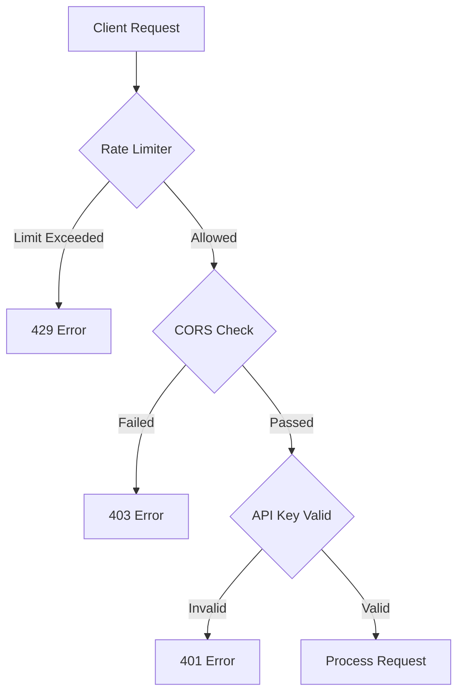
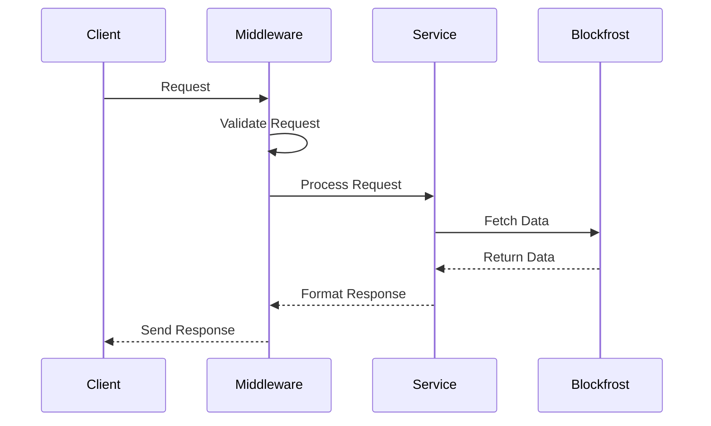
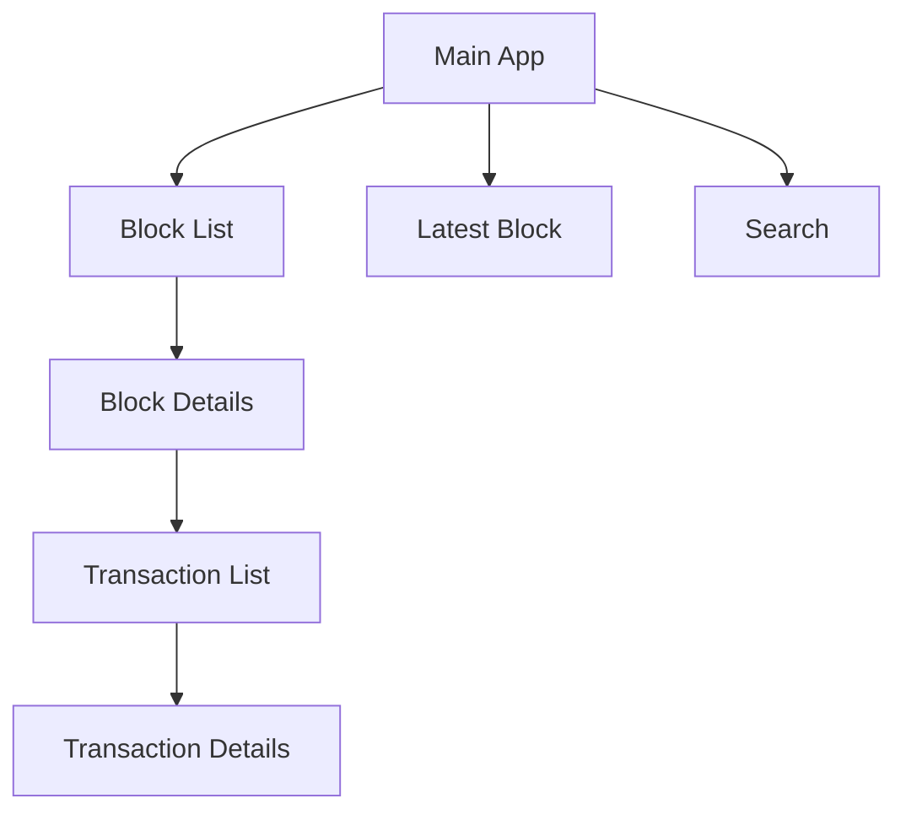

# Cardano Block Explorer Technical Documentation

> For high-level architecture overview, see [ARCHITECTURE.md](/docs/ARCHITECTURE.md)

## System Components

### 1. API Layer

The API layer handles all incoming requests and implements core security features.

```javascript
// Server Configuration
const app = express();
app.use(cors(corsOptions));
app.use(helmet(securityConfig));
app.use(rateLimit(rateLimitConfig));
```

### 2. Security Layer



#### Security Configurations

```javascript
const securityConfig = {
  contentSecurityPolicy: {
    directives: {
      defaultSrc: ["'self'"],
      scriptSrc: ["'self'", "'unsafe-inline'"],
      styleSrc: ["'self'", "'unsafe-inline'"],
      imgSrc: ["'self'", 'data:', 'https:'],
      connectSrc: ["'self'", 'https://cardano-mainnet.blockfrost.io'],
    },
  },
  referrerPolicy: { policy: 'same-origin' },
};

const rateLimitConfig = {
  windowMs: 15 * 60 * 1000,
  max: 100,
  standardHeaders: true,
  legacyHeaders: false,
};
```

### 3. Service Layer

The service layer handles business logic and data transformation.

```javascript
// Block Service Example
const getBlockDetails = async (hash) => {
  validateHash(hash);

  const cachedBlock = await cache.get(`block:${hash}`);
  if (cachedBlock) return cachedBlock;

  const block = await fetchFromBlockfrost(`/blocks/${hash}`);
  await cache.set(`block:${hash}`, block);

  return block;
};
```

### 4. Error Handling

```javascript
class APIError extends Error {
  constructor(message, statusCode = 500, type = 'error') {
    super(message);
    this.statusCode = statusCode;
    this.status = `${statusCode}`.startsWith('4') ? 'fail' : 'error';
    this.type = type;
  }

  static validation(message) {
    return new APIError(message, 400, 'validation');
  }

  static notFound(message) {
    return new APIError(message, 404, 'not_found');
  }
}
```

## API Implementation

### Request Flow



### Endpoint Implementations

#### Latest Block

```javascript
router.get(
  '/latest',
  asyncHandler(async (req, res) => {
    const block = await getLatestBlock();
    res.json({ success: true, data: block });
  })
);
```

#### Block Details

```javascript
router.get(
  '/:hash',
  validateHash,
  asyncHandler(async (req, res) => {
    const block = await getBlockDetails(req.params.hash);
    res.json({ success: true, data: block });
  })
);
```

## Frontend Implementation

### Component Architecture



### State Management

```javascript
class ExplorerState {
  constructor() {
    this.autoRefreshInterval = null;
    this.currentBlockHash = null;
  }

  setCurrentBlock(hash) {
    this.currentBlockHash = hash;
  }

  clearCurrentBlock() {
    this.currentBlockHash = null;
  }
}
```

## Testing Implementation

### Unit Tests

```javascript
describe('Block Service', () => {
  it('should validate block hash', () => {
    expect(() => validateHash('invalid')).toThrow('Invalid block hash');
  });

  it('should fetch latest block', async () => {
    const block = await getLatestBlock();
    expect(block).toHaveProperty('hash');
  });
});
```

### Integration Tests

```javascript
describe('API Endpoints', () => {
  it('should return latest block', async () => {
    const response = await request(app).get('/api/blocks/latest').expect(200);

    expect(response.body.success).toBe(true);
  });
});
```

## Security Best Practices

### 1. Input Validation

```javascript
const validators = {
  isValidHash: (hash) =>
    typeof hash === 'string' && /^[0-9a-fA-F]{64}$/.test(hash),
  isValidAddress: (address) =>
    typeof address === 'string' && /^addr1[a-zA-Z0-9]+$/.test(address),
  isValidBlockHeight: (height) => {
    const num = parseInt(height);
    return !isNaN(num) && num >= 0;
  },
};
```

### 2. Error Sanitization

```javascript
const sanitizeError = (error) => ({
  message: error.message,
  status: error.status,
  type: error.type,
  ...(process.env.NODE_ENV === 'development' && { stack: error.stack }),
});
```

### 3. Rate Limiting

```javascript
const rateLimiter = rateLimit({
  windowMs: 15 * 60 * 1000,
  max: 100,
  message: {
    status: 'error',
    message: 'Too many requests',
  },
});
```

## Performance Optimization

### 1. Caching Strategy

```javascript
class CacheManager {
  constructor() {
    this.cache = new Map();
    this.ttl = 5 * 60 * 1000;
  }

  async get(key) {
    const item = this.cache.get(key);
    if (!item) return null;
    if (Date.now() > item.expiry) {
      this.cache.delete(key);
      return null;
    }
    return item.value;
  }

  set(key, value) {
    this.cache.set(key, {
      value,
      expiry: Date.now() + this.ttl,
    });
  }
}
```

### 2. Response Optimization

```javascript
const optimizeResponse = (data) => {
  // Remove unnecessary fields
  const { internal_id, ...rest } = data;
  return rest;
};
```

## Monitoring and Logging

### 1. Request Logging

```javascript
const requestLogger = (req, res, next) => {
  const start = Date.now();
  res.on('finish', () => {
    logger.info('Request completed', {
      method: req.method,
      path: req.path,
      duration: Date.now() - start,
      status: res.statusCode,
    });
  });
  next();
};
```

### 2. Error Logging

```javascript
const errorLogger = (error, req, res, next) => {
  logger.error('Request error', {
    error: {
      message: error.message,
      stack: error.stack,
      type: error.type,
    },
    request: {
      method: req.method,
      path: req.path,
      query: req.query,
    },
  });
  next(error);
};
```

## Contributing Guidelines

### Code Style

1. Use meaningful variable names
2. Add JSDoc comments for functions
3. Follow type checking practices
4. Update documentation
5. Test thoroughly

### Git Workflow

1. Branch naming: `feature/`, `bugfix/`, `hotfix/`
2. Commit message format: `type(scope): description`
3. Pull request template:

   ```markdown
   ## Description

   ## Changes Made

   ## Testing Done

   ## Security Considerations
   ```

### Documentation

1. Update API documentation
2. Maintain architecture diagrams
3. Document security considerations
4. Add JSDoc comments

## Deployment Process

### 1. Development

```bash
npm run dev
```

### 2. Production

```bash
# Build
npm run build

# Deploy to Vercel
vercel --prod
```

### 3. Configuration

```javascript
// vercel.json
{
  "version": 2,
  "builds": [
    {
      "src": "server/server.js",
      "use": "@vercel/node"
    }
  ],
  "routes": [
    {
      "src": "/api/(.*)",
      "dest": "/server/server.js"
    }
  ]
}
```
